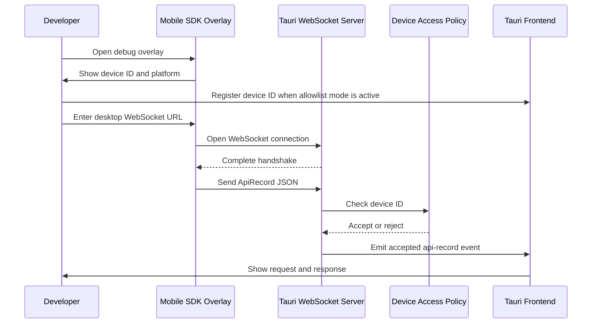

# SDK To Tauri Connection

## Purpose

This document defines the current iOS proof-of-concept connection to the Tauri
desktop app and the target connection design for the product MVP. It also
defines how the desktop applies a device access policy.

The connection is intended for local development and QA inspection. The mobile
SDK captures HTTP request and response data, sends an `ApiRecord` over
WebSocket, and the Tauri Rust backend validates and forwards accepted records
to the desktop UI.

## Scope Labels

- **Current concept:** implemented behavior under `concept/`
- **Target MVP:** required behavior described by the architecture and
  requirements documents
- **Future:** behavior intentionally deferred beyond the MVP

## Components

### Mobile SDK

- Generates and persists a device ID
- Includes a platform value in the shared schema
- Captures request headers and body
- Captures response status, headers, and body
- Connects to the desktop WebSocket endpoint

The current Swift package emits `ios` and sends one JSON record for each
completed request or request error. The schema also accepts `android` and
`unknown` for future clients, but Android SDK support is outside the MVP.

The target MVP should evolve this completed-record message into versioned
request lifecycle events so the desktop can show in-progress requests.

### Tauri Rust Backend

- Hosts the local WebSocket listener
- Accepts SDK connections
- Parses and validates incoming JSON
- Applies the configured device access policy
- Emits accepted records to the Tauri frontend

### Tauri Frontend

- Displays registered devices
- Lets the user name, enable, disable, or remove devices
- Shows request and response details
- Separates headers and bodies into tabs

## Connection Flow



## WebSocket Address

The SDK must connect to an address reachable from the mobile runtime.

| Runtime | Example URL | Desktop listener requirement |
| --- | --- | --- |
| iOS Simulator | `ws://127.0.0.1:8787` | Bind to `127.0.0.1:8787` |
| Physical device | `ws://192.168.1.10:8787` | Bind to `0.0.0.0:8787` or the Mac LAN IP |

A future Android emulator client would normally use
`ws://10.0.2.2:8787`, but Android SDK support is not part of the MVP.

For a physical device:

- The desktop and device must be on the same reachable network.
- The desktop firewall must allow the configured port.
- The desktop should advertise or display its reachable LAN address.
- Production implementations should authenticate the connection and prefer
  encrypted transport where practical.

The current concept server binds to `127.0.0.1:8787`, so it supports the iOS
Simulator on the same Mac. Supporting a physical device requires changing the
listener binding and reviewing local-network security.

## SDK Connection Example

```swift
import QAConceptSDK

try await ConceptWebSocketClient.shared.connect(
    to: "ws://127.0.0.1:8787"
)

let logger = ConceptNetworkLogger(
    webSocketClient: ConceptWebSocketClient.shared
)

let (data, response) = try await logger.data(for: request)
```

When `QAConceptSDKUI` is included, the same connection can be managed from the
debug overlay. The overlay persists the last WebSocket URL and shows:

- Device ID
- Platform
- Connection status
- Connect, reconnect, and disconnect actions

## Current Concept Record

The current concept sends one completed `ApiRecord` with enough identity and
transport metadata for filtering.

```json
{
  "id": "B17C8B24-02A8-4F70-A7F4-59B18BA8EC31",
  "deviceId": "DEVICE-ID",
  "platform": "ios",
  "timestamp": "2026-06-08T04:00:00Z",
  "method": "POST",
  "url": "https://api.example.com/items",
  "requestHeaders": {},
  "requestBodyPreview": null,
  "statusCode": 200,
  "responseHeaders": {},
  "responseBodyPreview": null,
  "durationMs": 125,
  "errorMessage": null
}
```

## Target MVP Envelope

The target protocol should add:

- `schemaVersion`
- `messageType`
- `requestId`
- connection or session identifiers
- event-specific payload data

Target message types are defined in
[QA Tool System Architecture](./system-architecture.md#transport-design).

## Device Access Policy

The target desktop should support a configurable access policy:

### Open Mode

- Accept records from any device that can reach the listener.
- Suitable only for isolated local development.
- The UI may still show observed device IDs for filtering.

### Allowlist Mode

- Accept records only from registered and enabled device IDs.
- Reject unregistered or disabled devices before emitting records to the UI.
- Persist device registration locally.
- Let the user assign a readable device name.
- Preserve a disabled device so it can be re-enabled without registration.

Recommended configuration model:

```text
deviceAccessPolicy:
  mode: open | allowlist
  default: allowlist
```

The current concept implements allowlist mode as mandatory. The target MVP
settings screen should expose the `open` or `allowlist` choice, with allowlist
as the default.

## Allowlist Workflow

1. Open the SDK overlay.
2. Copy the displayed device ID.
3. Open the desktop device menu.
4. Enter a readable device name and paste the device ID.
5. Register the device.
6. Keep the device enabled to accept records.
7. Disable it to temporarily reject records without removing it.
8. Remove it to delete the local registration.

The desktop normalizes device IDs before comparison. Platform information is
updated after the first accepted record.

## Security Requirements

A device ID and allowlist are filtering controls, not authentication. Device
IDs can be copied or forged by another client.

Before using this outside a controlled local network, add:

- Short-lived pairing token
- Trusted desktop identity
- Per-connection authentication
- Message schema validation and size limits
- Sensitive-header and body redaction
- TLS or another encrypted transport strategy
- Audit logging for accepted and rejected connections

## Failure Behavior

- Invalid WebSocket URL: show a connection error in the SDK overlay.
- Failed handshake or ping: mark the SDK as disconnected.
- Invalid JSON: discard the message and record a diagnostic.
- Unknown device in allowlist mode: reject the record.
- Disabled device: reject the record without deleting registration.
- Duplicate record or event ID: keep one UI entry.
- Closed connection: allow manual reconnect now and automatic reconnect later.
