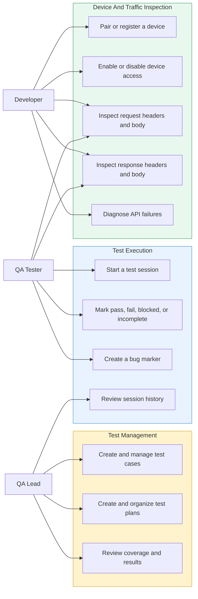
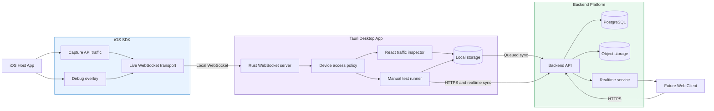
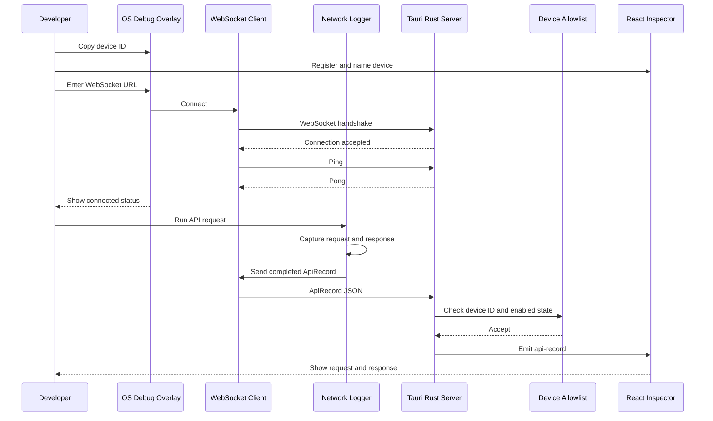
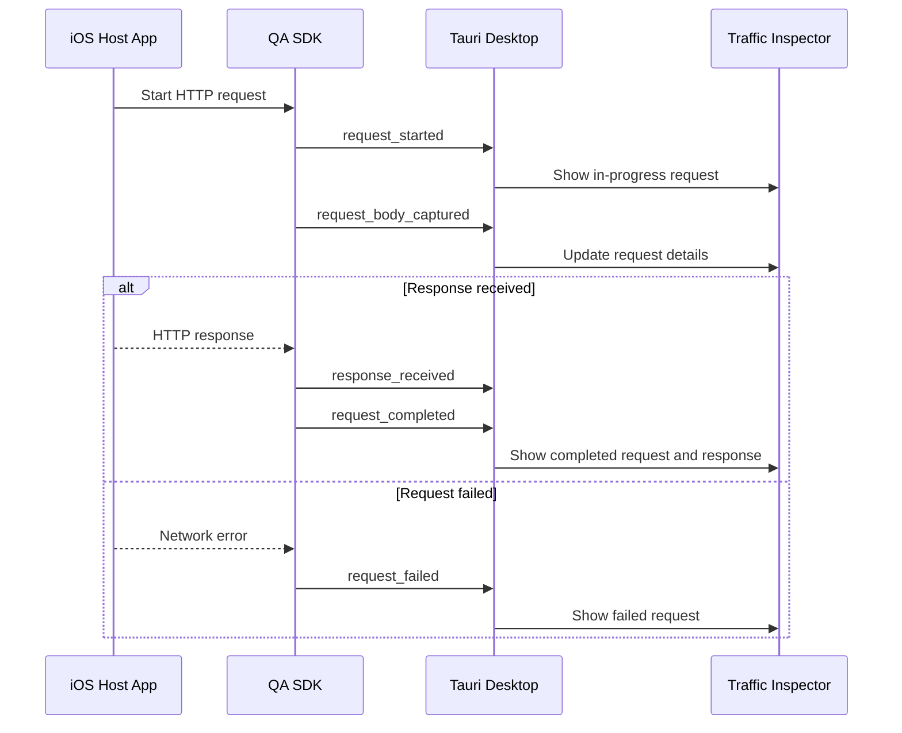
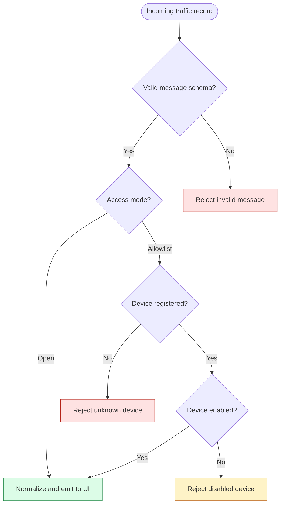
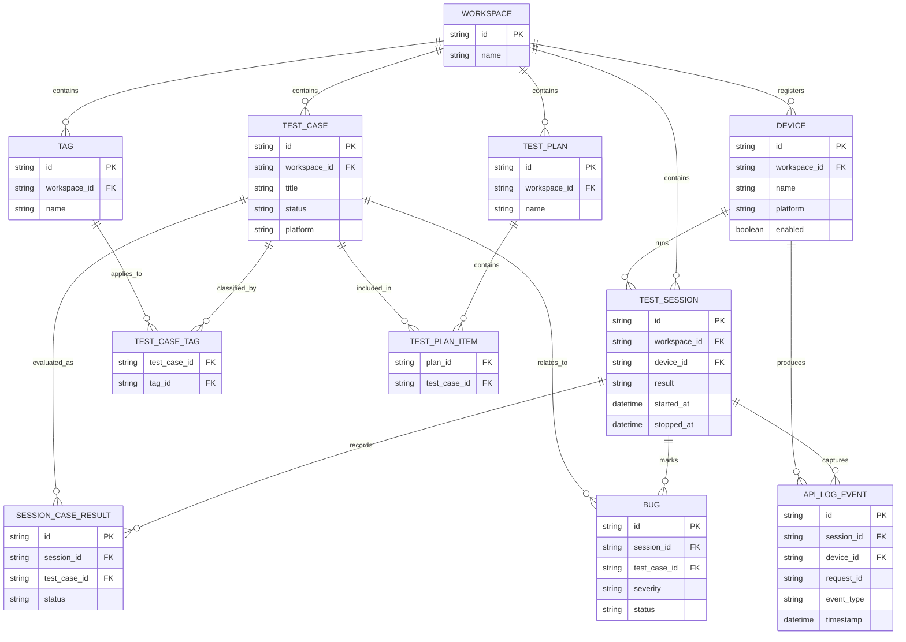
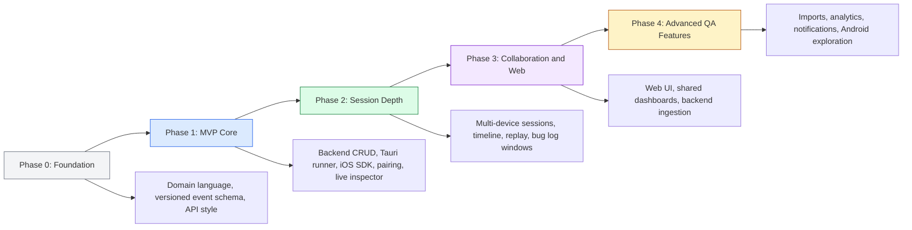

# QA Tool System Charts

## Purpose

This document provides a shared set of Mermaid charts for product discussion,
technical planning, onboarding, and design work.

Use these scope labels when discussing a chart:

- **Current concept:** behavior implemented under `concept/`
- **Target MVP:** behavior required for the first production version
- **Future:** behavior intentionally deferred beyond the MVP

The written source of truth remains:

- [QA Tool Requirements](./qa-tool-requirements.md)
- [QA Tool System Architecture](./system-architecture.md)
- [SDK To Tauri Connection](./sdk-tauri-connection.md)
- [QA Tool Implementation Roadmap](./implementation-roadmap.md)

## Chart Index

| Chart | Scope | Primary audience |
| --- | --- | --- |
| Product use cases | Target MVP | Product, design, engineering |
| System context | Target MVP and future | Engineering, architecture |
| Current SDK connection | Current concept | Mobile and desktop engineers |
| Target request lifecycle | Target MVP | Mobile and desktop engineers |
| Device access decision | Current concept and target MVP | Desktop engineers, security |
| Domain relationship model | Target MVP | Backend and product engineers |
| Delivery phases | Target product | Whole team |

## Product Use Cases

This chart shows the main actions available to each product persona. It is a
use-case-oriented flowchart, not a strict UML use-case diagram.

## System Context

This chart shows the target MVP system boundary and the future browser path.
The direct SDK-to-desktop stream remains available even when backend services
are unavailable.

## Current SDK Connection

This sequence reflects the current concept:

- Manual WebSocket URL
- Mandatory allowlist
- One completed `ApiRecord` per request or error
- Tauri event emitted after the record is accepted

## Target Request Lifecycle

The target MVP should send versioned lifecycle events instead of waiting for a
single completed record. All events for one request share the same
`requestId`.

## Device Access Decision

The current concept always follows the allowlist branch. The target MVP adds a
setting for open mode while keeping allowlist mode as the default.

## Domain Relationship Model

This model covers the primary MVP relationships. Field-level definitions remain
in the system architecture document.

## Delivery Phases

This chart summarizes dependency order rather than calendar dates.

## Using These Charts

- Keep chart labels short and move detailed rules into prose.
- Update the written source of truth before changing a chart.
- Preserve the current concept, target MVP, and future distinctions.
- Use the same entity and event names across requirements, code, and design.
- Copy Mermaid blocks into FigJam, GitHub, or Mermaid-compatible documentation
  tools when a visual artifact is needed.
